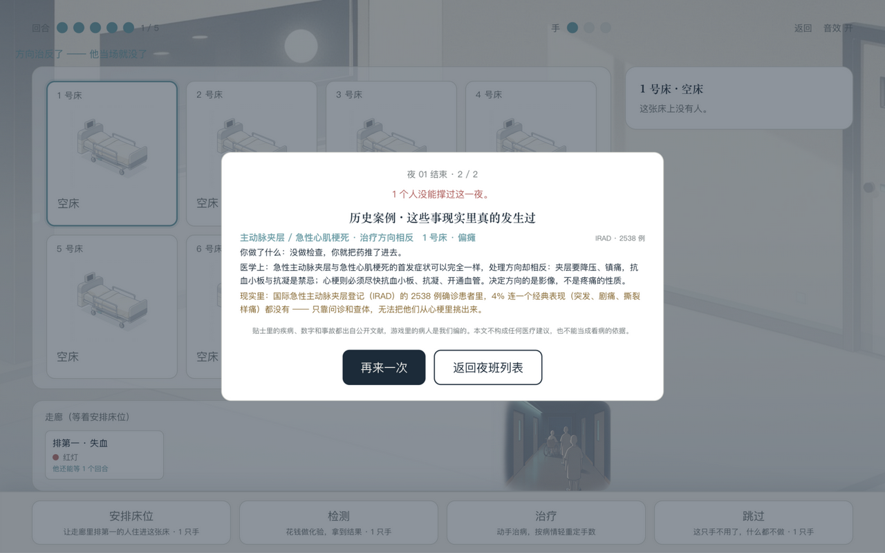

# 八张床 · 8 Beds

确定性医疗决策谜题 —— 八张床，三只手，一夜班。

**在线游玩：<https://game.8beds.haozi.dev>**


每个回合只有三只手（行动点）。点一张床，然后做检查、治疗、拉帘子隔离、洗手——在天亮前把所有人安全送走。**走错一步、浪费一只手，就赢不了**：每一关都按零余量配平，容错由你的排序给，不由手数给。

七关课程：交班 → 先分真假 → 邻床 → 帘后 → 看不见的手 → 长夜 → 八张床（地狱关：三种「长得一样的病」同场、八张床全满、全部机制同时到场）。

---

## 机制设计

### 1. 手的经济：治疗分档

| 动作 | 手数 |
|---|---|
| 安排床位 / 检测 / 洗手 / 隔离 / 跳过 | 1 |
| 急救（把病危压回重病） | 1 |
| 治愈（送走一个人） | 2 |
| 治疗神志不清病人的邻居 | 额外 +1（安抚费） |

如果治疗恒为 1 手，「直接清掉传染源」永远比隔离便宜——隔离会在价格上结构性破产。分档之后，**「治不起，但挡得起」第一次成为真实处境**：治愈一个黄灯传染源要 2 只手，隔离只要 1 只，而一回合只有 3 只——隔离的那只手，正是从治愈里省出来的。

「跳过」也是一只手：这只手不用了，什么都不做。它是主动结束回合的合法通道——有时最贵的一步棋是把手里剩下的机会白白放掉。

### 2. 镜像病例：确定性，不出选择题

同一主诉下藏着两种**处置方向完全相反**的病：脑梗死↔脑出血、心梗↔主动脉夹层、低血糖↔卒中。规则是纯确定性的：

- **不检测就治疗 = 当场死亡，这一局立即结束**（钱照扣、人没了、失败页给出精确归因）；
- **检测后治疗 = 自动执行正确方案**。

这里刻意不做成「检查后二选一」：玩家没有医学知识，让玩家在「溶栓」和「降颅压」之间做选择是知识测验，不是决策技能。镜像病人的全部玩法收敛为一道经济题——**要不要花这一只手做检测**。检测是保险费：不买，代价是整局游戏。

### 3. 隔离：全场唯一的帘子

帘子就是隔离本身。开局场上没有任何帘；**围住一张床，它四周的帘自动拉上；同时全场只能有一个人被隔离**——围上新人，旧人身上的帘整体搬走，旧床恢复敞开。

隔离是纯支出：不治病、人还在床上继续恶化、照样占着床。它真正的价格是那个**唯一的名额**：场上只有一个传染源时，帘子近乎仪式；出现第二个源时，帘子护得了谁，就护不了谁——你每时每刻都在做「这个名额给谁」的决定。这就是第 4 夜「帘后」的全部教学内容。

### 4. 传播：暴露是租金，不是罚款

每个回合末，沿所有没挂帘的边结算：HIGH 源给邻床 +2 点传染风险，LOW 源 +1。风险每满 2 点，病情加重一级（阶梯式，可以连升）。传播升级与自然病程在同一回合互斥——不会「一碰即死」。

**感染从不判负**：被传上的人病情加重、要多花手才能救回来——传染的代价走它自己的经济账，这就是时间压力本身。判负只看三件事：死亡（死 1 人即负）、后遗症名额、出院进度。同样，隔离也从来不是硬任务——每关在禁用隔离后仍然可解（求解器逐关验证），它是一笔可选的保险。

### 5. 误诊：没有「之后」

不检测就治疗镜像病人：归因事件先落、然后是死亡、然后这一局当帧结束。没有补救窗口、没有「拉回来」的第二次机会——误诊在这里不是可挽回的过程错误，是终点。失败页上，这一夜的最后一句话是一条**真实病例贴士**（见「开发细节 → 文案工程」），而不是一串抽象的状态变化。

### 6. 看不见的手（第 5 夜起同时到场）

- **手卫生**：碰过传染源的手会脏；用脏手治疗别人 = 把病原体直接交到他手上（风险 +1）。洗手 1 只手。聪明的排序（先做干净的事、最后碰源）可以整夜不洗手——但只要顺序错一次，账单就到。
- **床单元污染**：传染源离床后，床记着他——下一个住进这张床的人立刻吃一次暴露风险。污渍画在床面上，每回合淡一格。
- **神志不清的病人**：他在床一天，邻床的每次治疗都要多花 1 只手安抚。治疗他本人就是最便宜的安静剂——但那只手永远在和真正病危的人抢预算。这笔安抚费在结算事件里**点名到那个闹的人**——失败复盘知道该怪谁。
- **隐匿携带者**：全场看起来最健康的人可能在排菌，病例卡上没有任何线索——只有检测能发现他。要隔离的可能是气色最好的那个人。

### 7. 抢救期限与后遗症（第 6 夜起）

部分病人带抢救倒计时。拖过期限**不会死**，但会落下残疾、自己离开病房——「慢」成为与「错」完全独立的第三种失败维度。地狱关里残疾名额只有 1 个：参考解要**主动决定谁带着残疾离开**，把省下的手用来救其余八个人。

### 8. 走廊压力

走廊容量有限。超员的那一刻，所有还在等床位的人病情集体加重一级——收人进床不只是治疗的前置，也是给走廊减负。

### 9. 胜负模型

死 1 人即负（全关 `maxDeaths = 0`）；全员（含未到达者）出院才赢；出院免费——达成指征当帧自动离床，是结算不是动作；后遗症超出名额即负。

---

## 开发细节

### 架构：三层各自独立

```
src/core/     纯函数规则引擎（零随机、零 IO）
src/solver/   A* 关卡求解器（直接复用 reducer，不另写一套规则）
src/ui/       DOM 渲染层 + 文案子模块
levels/       关卡数据（纯 JSON，数据驱动）
```

`reduce(state, action)` 是唯一的状态转移入口，`legalActions(state)` 是合法性的唯一来源。同一关卡 + 同一动作序列**必然**得到同一终局——这是求解器配平在数学上成立的前提。传播、隔离、时间窗、手卫生、谵妄、队列压力……全部机制都在 core 的千行以内，UI 层碰不到任何规则数值。

### 求解器驱动的配平流水线

这个项目最特殊的工程部分：**每一关的数值都由求解器证明，而不是手调**。

- 搜索代价 g = **AP 而非动作数**——治愈 2 手、谵妄安抚 +1，最小手数 ≠ 路径长度。早期版本按动作数算，凡最优解含隔离的关卡全部偏乐观；
- **可采纳启发式**：每个待出院患者的下界（收治 + 必要检测 + (病情−1)×急救 + 治愈），按代价排序取前 N 求和；谵妄安抚费与后遗症名额的处理都经过可采纳性论证（前者玩家可先解除所以不能计入，后者必须按名额抵扣否则高估）；
- **支配剪枝**：不检测就治镜像病人、对干净的手洗手——这些动作合法（玩家可以做，后果自负），但被支配，不进搜索；
- **巨型关卡的诚实处理**：地狱关（9 患者 × 10 回合）的状态空间超出单机穷尽预算（约 60 万节点 / 2.5GB），于是加权 A*（f = g + w·h，可行性剪枝仍用原始 h）快速找到 29 手可行解，再以上界种子做 branch-and-bound 收紧。参考解**重放获胜**并作为回归护栏锁定，同时在基线里诚实标注「非穷尽最优」；
- **内存工程**：状态指纹 64 位哈希（FNV-1a 双趟）、节点展开后即释放状态本体——百万态搜索的 Map 开销降一个量级。

### 防漂移的测试体系（17 个文件，215 个用例）

| 测试 | 护什么 |
|---|---|
| `contract.test.ts` | 规则契约逐条翻成断言——改规则不改测试会红，改测试不改规则也会红 |
| `golden.test.ts` | 七关的最小手数/余量/隔离次数回归基线 + 地狱关参考解重放 |
| `copy.test.ts` | 文案三层护栏：术语黑名单 / 缺主语的碎片句 / 内部编号（`N01` 这类） |
| `tips / review / forecast / misdiagnosis` | 死亡贴士的医学真实性边界、失败复盘的归因精确度、病情预告的算术、误诊判负路径 |

配平数字的改动流程被固化成「契约 → 契约测试 → 黄金基线」三件套：任何一层单独漂移，测试立刻红。

### 文案工程：两条方向相反的纪律

- **界面**：说人话，小学生能懂。「谵妄」→「神志不清、又喊又闹」；「暴露 3/阈值 4」→「满 4 点他就会加重一级」；内部编号 `N01` 在任何界面位置都不允许出现（一律「4 号床 · 受了外伤」）。每条纪律都有机器护栏（`copy.test.ts` + 浏览器实拍 dump 复审脚本）。
- **死亡贴士**：唯一刻意专业的地方——真实病名、真实机制、真实发表过的数据（静脉溶栓的出血禁忌、NINDS 的病例数、脓毒性休克的死亡率）。玩家输掉一夜后看到的不是「你做错了第几步」，而是一份真实的病例。

### 失败复盘：归因到回合

失败页只回答三个问题：谁没了；是第几个回合、因为什么没的；下一把改哪一件事。数据全部来自 reducer 的 history（每条动作带事件与回合号），所以复盘能精确到「第 1 回合，检查还没做，你就动手了」——不是泛泛的安慰。



### 病例卡与预告：算得出但不该玩家心算的，直接给结论

所有决策建立在两类倒计时上：这个人几回合后病危、邻床的风险几回合后够加重一级。玩家不可能在脑内维护 8 个患者的五元组，所以界面直接给结论数字（「他的病情 1 个回合后变成红灯」）——但**只给事实与算术，绝不给「所以你该点检测」**：该做什么，是玩家的判断。


### UI：DOM 渲染 + 零素材音频

v1 是 Phaser Canvas，v2 整体重写为 DOM：语义可定位（自动化测试直接用无障碍树）、文案护栏能审真实渲染产物、深链接（`?level=night-06`）与浏览器历史栈同步。美术策略：AI 生成的纹理与插画只用于「实体」（墙面/地板/床/污渍），所有「信息」一律代码绘制——信息会随机制改动，实体不会。音效是 WebAudio 振荡器实时合成（每个结算事实对应一个声音），仓库里没有一个音频文件。

### 性能

手写 `cloneState` 替代 `structuredClone`（快约 11 倍，等价性有专门测试）——求解器每步都在克隆状态，这是全流水线速度的地基。九患者关卡求解在秒级。

### 关卡表（数字全部由求解器实测）

| 夜 | 主题 | 教什么 | 最小手数 / 预算 |
|---|---|---|---|
| 00 交班 | 4 人 | 点床、治疗、送走；治愈要 2 只手 | 12 / 12 |
| 01 先分真假 | 4 人 | 检测与镜像：不检测必死 | 14 / 15 |
| 02 邻床 | 7 人 | 传播 + 隔离：帘子教界面 | 27 / 27 |
| 03 帘后 | 8 人 | 唯一隔离位：名额给谁 | 26 / 27 |
| 04 看不见的手 | 6 人 | 手卫生 / 隐匿携带 / 神志不清 / 床污染 | 23* / 24 |
| 05 长夜 | 8 人 | 抢救期限零残疾 + 走廊压力 + 全机制复用 | 24 / 24 |
| 06 八张床 | 9 人 | 地狱关：三种镜像同场、满床、全机制串联 | 29* / 30 |

\* 参考解（重放获胜回归，非穷尽最优——见 `tests/golden.ts` 的诚实标注）。

---

## 运行

```bash
npm install
npm run dev        # 本地开发服务器
npm test           # 215 个用例
npm run verify     # tsc + 全部测试

# 配平工具链（求解器复用 reducer，无需另起服务）
npm run solve      # 七关可解性与预算报告
npm run gates      # 隔离闸门：禁用隔离后仍须可解 + Δ（隔离省不省手）
npm run why:lose   # 无解关卡诊断：从第几回合开始必死、死因直方图
npm run tune       # 启发式下界 vs 真实最小手数 + 预算扫描
```

需要 Node 18+。无任何运行时依赖——devDependencies 只有 TypeScript / Vite / Vitest。

## License

[MIT](LICENSE)。你可以自由地复制、修改、再分发、商用或私用本项目的全部代码，唯一条件是在你的副本中保留原始的版权声明与许可文本。本项目按「现状」提供，不附带任何担保。关卡文案中的医学表述（病名、机制、统计数据）以科普为目的写作，不构成任何医疗建议。
